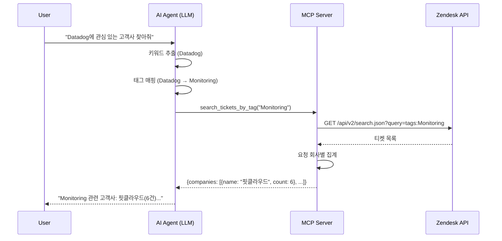
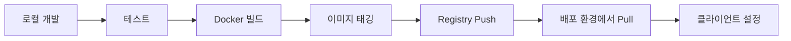

# Saltware Zendesk MCP Server

## 1. 프로젝트 개요

### 1.1 목적
Zendesk 티켓 데이터를 활용하여 AI Agent가 고객 지원 관련 인사이트를 제공할 수 있도록 하는 MCP(Model Context Protocol) 서버 개발

### 1.2 주요 기능
- Zendesk 티켓 데이터 조회 및 분석
- 서비스/제품 키워드 기반 고객사 관심도 분석
- 티켓 통계 및 담당자 성과 분석
- 서비스 문의 트렌드 분석

---

## 2. 기술 스택

| 구분 | 기술 |
|------|------|
| Runtime | Python 3.11+ |
| Language | Python |
| MCP Framework | FastMCP |
| API Client | Zendesk API v2 (httpx) |
| 인증 | Zendesk API Token |
| 배포 | Docker |
| 통신 | HTTP (Streamable HTTP) |

---

## 3. 시스템 아키텍처

```
┌─────────────────────────────────────┐
│            AI Agent (LLM)           │
│  - 사용자 의도 파악                 │
│  - 키워드 → 서비스 태그 매핑        │
│  - 최종 응답 생성                   │
└──────────────────┬──────────────────┘
                   │ 서비스 태그 전달
                   ▼
┌─────────────────────────────────────┐
│          MCP Server (zendesk-mcp)   │
│  - 태그 기반 티켓 검색              │
│  - 요청 회사별 집계                 │
│  - 담당자/트렌드 분석               │
└──────────────────┬──────────────────┘
                   │
                   ▼
┌─────────────────────────────────────┐
│           Zendesk API               │
└─────────────────────────────────────┘
```

### 3.1 역할 분리
| 구성요소 | 역할 |
|----------|------|
| LLM (AI Agent) | 사용자 프롬프트 해석, 키워드→서비스 태그 매핑, 결과 해석 및 응답 생성 |
| MCP Server | 태그 기반 Zendesk API 호출, 데이터 집계 및 통계 처리 |

---

## 4. MCP Tools 명세

### 4.1 search_tickets_by_tag
**설명**: 서비스 분류 태그 기반으로 티켓을 검색하고 고객사별로 집계

> ⚠️ **참고**: 키워드→태그 매핑은 LLM이 수행하며, MCP Server는 전달받은 태그로 검색만 수행

| 파라미터 | 타입 | 필수 | 설명 |
|----------|------|------|------|
| service_tag | string | ✅ | 검색할 서비스 분류 태그 (예: "Monitoring", "Cloud Infrastructure") |
| period_days | number | ❌ | 검색 기간 (기본값: 365일) |

**반환값**:
```json
{
  "service_tag": "Monitoring",
  "total_tickets": 15,
  "companies": [
    { "name": "핏클라우드", "ticket_count": 6 },
    { "name": "솔트웨어", "ticket_count": 1 }
  ]
}
```

### 4.2 get_top_agents
**설명**: 기간 내 가장 많은 티켓을 해결한 담당자 조회

| 파라미터 | 타입 | 필수 | 설명 |
|----------|------|------|------|
| period_days | number | ❌ | 검색 기간 (기본값: 30일) |
| limit | number | ❌ | 반환할 담당자 수 (기본값: 10) |

**반환값**:
```json
{
  "period": "2025-12-07 ~ 2026-01-07",
  "agents": [
    { "name": "홍길동", "solved_count": 45 },
    { "name": "김철수", "solved_count": 32 }
  ]
}
```

### 4.3 get_service_trends
**설명**: 서비스별 문의 빈도 분석

| 파라미터 | 타입 | 필수 | 설명 |
|----------|------|------|------|
| period_days | number | ❌ | 검색 기간 (기본값: 90일) |
| limit | number | ❌ | 반환할 서비스 수 (기본값: 10) |

**반환값**:
```json
{
  "period": "2025-10-07 ~ 2026-01-07",
  "services": [
    { "category": "Monitoring", "ticket_count": 120 },
    { "category": "Cloud Infrastructure", "ticket_count": 85 }
  ]
}
```

### 4.4 get_ticket_details
**설명**: 특정 티켓의 상세 정보 조회

| 파라미터 | 타입 | 필수 | 설명 |
|----------|------|------|------|
| ticket_id | number | ✅ | Zendesk 티켓 ID |

### 4.5 search_tickets
**설명**: 자유 검색어로 티켓 검색

| 파라미터 | 타입 | 필수 | 설명 |
|----------|------|------|------|
| query | string | ✅ | 검색 쿼리 |
| status | string | ❌ | 티켓 상태 필터 (open, pending, solved 등) |
| period_days | number | ❌ | 검색 기간 |

---

## 5. 서비스 태그 목록 (LLM 참조용)

LLM이 사용자 키워드를 서비스 태그로 매핑할 때 참조하는 정보입니다.
MCP Server는 이 매핑을 수행하지 않으며, LLM이 직접 판단합니다.

### 5.1 서비스 태그 및 관련 키워드 예시
| 서비스 태그 | 관련 키워드 (예시) |
|-------------|--------------------|
| Monitoring | Datadog, New Relic, Prometheus, Grafana, CloudWatch |
| Cloud Infrastructure | AWS, GCP, Azure, Kubernetes, Docker |
| Security | Okta, Auth0, Cloudflare, WAF |
| DevOps | Jenkins, GitHub Actions, CircleCI, ArgoCD |
| Database | MongoDB, PostgreSQL, MySQL, Redis, DynamoDB |

### 5.2 LLM 프롬프트 가이드
AI Agent가 키워드를 태그로 매핑할 때 사용할 시스템 프롬프트 예시:

```text
사용자가 특정 제품/서비스에 관심 있는 고객사를 찾으려 할 때:
1. 언급된 제품/서비스 키워드를 추출하세요
2. 해당 키워드가 속하는 서비스 분류 태그를 판단하세요
   - Monitoring: 모니터링, 관측성 관련 (Datadog, New Relic 등)
   - Cloud Infrastructure: 클라우드 인프라 관련 (AWS, GCP, Azure 등)
   - Security: 보안, 인증 관련 (Okta, Auth0 등)
   - DevOps: CI/CD, 배포 자동화 관련 (Jenkins, ArgoCD 등)
   - Database: 데이터베이스 관련 (MongoDB, PostgreSQL 등)
3. search_tickets_by_tag 도구를 해당 태그로 호출하세요
```

---

## 6. Zendesk API 연동

### 6.1 필요한 API 엔드포인트
| 엔드포인트 | 용도 |
|------------|------|
| `GET /api/v2/search.json` | 티켓 검색 |
| `GET /api/v2/tickets/{id}.json` | 티켓 상세 조회 |
| `GET /api/v2/users/{id}.json` | 사용자(담당자) 정보 조회 |
| `GET /api/v2/ticket_fields/{id}.json` | 커스텀 필드 조회 |

### 6.2 주요 필드
| 필드 ID | 필드명 | 설명 |
|---------|--------|------|
| 360028549453 | 요청 회사 | 티켓 요청 고객사 |
| (확인 필요) | 서비스 분류 | 서비스 카테고리 태그 |

### 6.3 인증 설정
```env
ZENDESK_SUBDOMAIN=saltware
ZENDESK_EMAIL=api-user@saltware.co.kr
ZENDESK_API_TOKEN=your_api_token_here
```

---

## 7. 사용 시나리오

### 시나리오 1: 특정 서비스에 관심 있는 고객사 찾기

**사용자 프롬프트**:
```text
"{Datadog}에 관심을 가질만한 고객사 리스트를 찾아줘"
```

**처리 흐름**:
1. Agent가 프롬프트를 수신
2. **LLM이 키워드 추출 및 태그 매핑** (Datadog → Monitoring)
3. MCP Server `search_tickets_by_tag` 호출 (service_tag: "Monitoring")
4. MCP Server가 1년 이내 "Monitoring" 태그 티켓 검색
5. 요청 회사 필드(360028549453) 값 집계
6. 결과 반환 → LLM이 최종 응답 생성



**예상 응답**:
```text
Datadog(Monitoring 서비스)에 관심을 보인 고객사 목록입니다:

1. 핏클라우드 - 6건의 문의
2. ABC테크 - 4건의 문의
3. 솔트웨어 - 1건의 문의

총 11건의 Monitoring 관련 티켓이 확인되었습니다.
```

### 시나리오 2: 담당자 성과 분석

**사용자 프롬프트**:
```text
"최근 가장 많이 티켓을 해결한 담당자가 누구야?"
```

### 시나리오 3: 서비스 트렌드 분석

**사용자 프롬프트**:
```text
"주로 가장 많이 물어보는 서비스 문의가 뭐야?"
```

---

## 8. 에러 처리

| 에러 코드 | 상황 | 처리 방법 |
|-----------|------|-----------|
| ZENDESK_AUTH_ERROR | API 인증 실패 | 토큰 재확인 안내 |
| ZENDESK_RATE_LIMIT | API 호출 한도 초과 | 재시도 로직 (exponential backoff) |
| INVALID_TAG | 존재하지 않는 서비스 태그 | 유효한 태그 목록 반환 |
| NO_RESULTS | 검색 결과 없음 | 기간 확대 또는 조건 완화 제안 |

---

## 9. 프로젝트 구조 (예시)

```
zendesk-mcp/
├── src/
│   ├── __init__.py
│   ├── server.py             # MCP 서버 엔트리포인트 (FastMCP)
│   ├── tools/
│   │   ├── __init__.py
│   │   ├── search_tickets_by_tag.py  # 태그 기반 티켓 검색
│   │   ├── search_tickets.py         # 자유 검색
│   │   ├── get_ticket_details.py     # 티켓 상세 조회
│   │   ├── get_top_agents.py         # 담당자 성과 분석
│   │   └── get_service_trends.py     # 서비스 트렌드 분석
│   ├── services/
│   │   ├── __init__.py
│   │   └── zendesk_client.py  # Zendesk API 클라이언트 (httpx)
│   ├── models/
│   │   ├── __init__.py
│   │   └── schemas.py         # Pydantic 모델 정의
│   └── utils/
│       ├── __init__.py
│       └── date_utils.py      # 날짜 유틸리티
├── Dockerfile
├── docker-compose.yml
├── pyproject.toml             # Python 프로젝트 설정
├── requirements.txt           # 의존성 목록
├── .env.example
└── README.md
```

---

## 10. Docker 배포

### 10.1 Dockerfile
```dockerfile
# Build stage
FROM python:3.11-slim AS builder

WORKDIR /app

# Install uv for fast package management
RUN pip install uv

COPY pyproject.toml requirements.txt ./
RUN uv pip install --system -r requirements.txt

COPY src ./src

# Production stage
FROM python:3.11-slim AS production

WORKDIR /app

# Install uv
RUN pip install uv

COPY --from=builder /usr/local/lib/python3.11/site-packages /usr/local/lib/python3.11/site-packages
COPY --from=builder /app/src ./src

# HTTP 포트 노출 (Streamable HTTP)
EXPOSE 8000

# MCP 서버를 HTTP 모드로 실행
ENTRYPOINT ["python", "-m", "src.server"]
```

### 10.2 docker-compose.yml
```yaml
version: '3.8'

services:
  zendesk-mcp:
    build: .
    image: zendesk-mcp:latest
    container_name: zendesk-mcp
    ports:
      - "8000:8000"  # HTTP (Streamable HTTP) 포트
    environment:
      - ZENDESK_SUBDOMAIN=${ZENDESK_SUBDOMAIN}
      - ZENDESK_EMAIL=${ZENDESK_EMAIL}
      - ZENDESK_API_TOKEN=${ZENDESK_API_TOKEN}
      - MCP_TRANSPORT=http
      - MCP_HOST=0.0.0.0
      - MCP_PORT=8000
    restart: unless-stopped
    healthcheck:
      test: ["CMD", "curl", "-f", "http://localhost:8000/health"]
      interval: 30s
      timeout: 10s
      retries: 3
```

### 10.3 Docker 이미지 빌드 및 실행
```bash
# 이미지 빌드
docker build -t zendesk-mcp:latest .

# 또는 docker-compose 사용
docker-compose build

# 컨테이너 실행 (HTTP 모드)
docker-compose up -d

# 로그 확인
docker-compose logs -f zendesk-mcp

# 직접 Docker 실행
docker run -d --name zendesk-mcp \
  -p 8000:8000 \
  --env-file .env \
  zendesk-mcp:latest
```

### 10.4 pyproject.toml 예시
```toml
[project]
name = "zendesk-mcp"
version = "1.0.0"
description = "Zendesk MCP Server for AI Agent integration"
requires-python = ">=3.11"
dependencies = [
    "fastmcp>=2.0.0",
    "httpx>=0.27.0",
    "pydantic>=2.0.0",
    "python-dotenv>=1.0.0",
]

[project.optional-dependencies]
dev = [
    "pytest>=8.0.0",
    "pytest-asyncio>=0.23.0",
    "ruff>=0.4.0",
]

[tool.ruff]
line-length = 100
target-version = "py311"
```

### 10.5 requirements.txt
```txt
fastmcp>=2.0.0
httpx>=0.27.0
pydantic>=2.0.0
python-dotenv>=1.0.0
```

---

## 11. MCP 클라이언트 연동 설정

Docker로 실행된 MCP 서버를 클라이언트에서 호출하는 방법입니다.

### 11.1 Claude Desktop 설정 (HTTP 모드)

`claude_desktop_config.json` 파일 위치:
- **Windows**: `%APPDATA%\Claude\claude_desktop_config.json`
- **macOS**: `~/Library/Application Support/Claude/claude_desktop_config.json`

```json
{
  "mcpServers": {
    "zendesk": {
      "url": "http://localhost:8000/mcp"
    }
  }
}
```

> 💡 HTTP 모드에서는 `command`/`args` 대신 `url`만 지정하면 됩니다.

### 11.1.1 원격 서버 연결 예시

```json
{
  "mcpServers": {
    "zendesk": {
      "url": "https://your-server.com/mcp",
      "headers": {
        "Authorization": "Bearer your_api_key"
      }
    }
  }
}
```

### 11.2 환경변수 파일 (.env)

Docker 서버 실행 시 사용할 환경변수 파일:

```env
# Zendesk API 설정
ZENDESK_SUBDOMAIN=saltware
ZENDESK_EMAIL=api-user@saltware.co.kr
ZENDESK_API_TOKEN=your_actual_token

# MCP 서버 설정 (HTTP 모드)
MCP_TRANSPORT=http
MCP_HOST=0.0.0.0
MCP_PORT=8000
```

### 11.3 Cursor 설정 (HTTP 모드)

Cursor Settings → Features → MCP Servers에서 추가:

```json
{
  "zendesk": {
    "url": "http://localhost:8000/mcp"
  }
}
```

### 11.3.1 Python Client 연동 예시

Python에서 FastMCP Client로 서버에 연결하는 예시:

```python
import asyncio
from fastmcp import Client

async def main():
    # Docker로 배포된 MCP 서버에 HTTP로 연결
    async with Client("http://localhost:8000/mcp") as client:
        # Tool 호출 예시
        result = await client.call_tool(
            name="search_tickets_by_tag",
            arguments={"service_tag": "Monitoring", "period_days": 90}
        )
        print(result)

asyncio.run(main())
```

### 11.4 통신 방식 설명

| 방식 | 설명 | 사용 케이스 |
|------|------|-------------|
| **HTTP** | Streamable HTTP (권장) ✅ | 웹 기반 클라이언트, 원격 서버, Docker 배포 |
| **stdio** | 표준 입출력으로 통신 | 로컬 개발, 직접 프로세스 호출 시 |
| **SSE** | Server-Sent Events (레거시) | 기존 SSE 인프라 호환 필요 시 |

현재 설정은 **HTTP (Streamable HTTP) 모드**로, Docker 컨테이너가 8000 포트에서 HTTP 요청을 처리합니다.

> 💡 **Streamable HTTP 장점**:
> - 양방향 스트리밍 지원
> - 표준 HTTP 인프라와 호환 (로드밸런서, 프록시 등)
> - 클라이언트에서 URL만으로 간편하게 연결
> - 컨테이너 환경에 최적화

### 11.5 연결 테스트

```bash
# 헬스체크
curl http://localhost:8000/health

# MCP 엔드포인트 테스트
curl -X POST http://localhost:8000/mcp \
  -H "Content-Type: application/json" \
  -d '{"jsonrpc":"2.0","id":1,"method":"initialize","params":{"protocolVersion":"2024-11-05","capabilities":{},"clientInfo":{"name":"test","version":"1.0.0"}}}'
```

정상 응답 예시:
```json
{
  "jsonrpc": "2.0",
  "id": 1,
  "result": {
    "protocolVersion": "2024-11-05",
    "capabilities": { "tools": {} },
    "serverInfo": { "name": "zendesk-mcp", "version": "1.0.0" }
  }
}
```

### 11.5.1 클라이언트 연결 URL

Docker로 배포된 MCP 서버에 연결할 때 사용하는 URL:

| 환경 | URL |
|------|-----|
| 로컬 개발 | `http://localhost:8000/mcp` |
| Docker 내부 | `http://zendesk-mcp:8000/mcp` |
| 원격 서버 | `https://your-domain.com/mcp` |

### 11.6 FastMCP CLI 테스트

FastMCP는 내장 CLI를 통해 서버를 쉽게 테스트할 수 있습니다:

```bash
# 로컬에서 FastMCP 서버 실행
fastmcp run src/server.py:mcp

# HTTP 모드로 실행 (개발 시)
fastmcp run src/server.py:mcp --transport http --port 8000

# MCP Inspector로 디버깅
fastmcp dev src/server.py:mcp
```

### 11.7 트러블슈팅

| 문제 | 원인 | 해결 방법 |
|------|------|----------|
| 컨테이너가 바로 종료됨 | `-i` 플래그 누락 | `docker run -i` 사용 |
| 환경변수 인식 안됨 | 경로 오류 | 절대 경로로 `--env-file` 지정 |
| 타임아웃 발생 | Zendesk API 연결 실패 | 네트워크 및 토큰 확인 |
| JSON 파싱 에러 | config 파일 문법 오류 | JSON 문법 검증 |

---

## 12. 개발 및 배포 워크플로우



### 12.1 개발 환경 실행
```bash
# 의존성 설치 (uv 사용 권장)
uv pip install -r requirements.txt

# 또는 pip 사용
pip install -r requirements.txt

# 개발 모드 실행 (FastMCP Inspector)
fastmcp dev src/server.py:mcp

# HTTP 모드로 로컬 실행 (개발 시)
fastmcp run src/server.py:mcp --transport http --port 8000

# 또는 Python 직접 실행
python -m src.server
```

### 12.2 Docker 배포 워크플로우
```bash
# 1. Docker 이미지 빌드
docker build -t zendesk-mcp:latest .

# 2. 로컬 테스트
docker-compose up -d
curl http://localhost:8000/health

# 3. 이미지 태깅 및 Registry Push
docker tag zendesk-mcp:latest your-registry.com/zendesk-mcp:1.0.0
docker push your-registry.com/zendesk-mcp:1.0.0

# 4. 프로덕션 배포
docker pull your-registry.com/zendesk-mcp:1.0.0
docker run -d --name zendesk-mcp \
  -p 8000:8000 \
  --env-file .env \
  your-registry.com/zendesk-mcp:1.0.0
```

---

## 13. 향후 확장 계획
- [ ] 고객 만족도(CSAT) 분석 Tool 추가
- [ ] 자연어 기반 복잡 쿼리 지원
- [ ] 캐싱 레이어 추가 (성능 최적화)
- [ ] 대시보드 연동 (Slack, Teams 알림)

---

## 14. FastMCP 코드 예시

### 14.1 메인 서버 (src/server.py)
```python
import os
from fastmcp import FastMCP
from dotenv import load_dotenv

from src.tools.search_tickets_by_tag import search_tickets_by_tag
from src.tools.search_tickets import search_tickets
from src.tools.get_ticket_details import get_ticket_details
from src.tools.get_top_agents import get_top_agents
from src.tools.get_service_trends import get_service_trends

# 환경변수 로드
load_dotenv()

# FastMCP 서버 인스턴스 생성
mcp = FastMCP(
    name="zendesk-mcp",
    version="1.0.0",
    description="Zendesk 티켓 데이터 분석을 위한 MCP 서버"
)

# Tools 등록
mcp.tool(search_tickets_by_tag)
mcp.tool(search_tickets)
mcp.tool(get_ticket_details)
mcp.tool(get_top_agents)
mcp.tool(get_service_trends)


if __name__ == "__main__":
    # 환경변수에서 설정 읽기 (기본값: HTTP 모드)
    transport = os.getenv("MCP_TRANSPORT", "http")
    host = os.getenv("MCP_HOST", "0.0.0.0")
    port = int(os.getenv("MCP_PORT", "8000"))
    
    mcp.run(transport=transport, host=host, port=port)
```

### 14.2 Tool 구현 예시 (src/tools/search_tickets_by_tag.py)
```python
from typing import Optional
from pydantic import BaseModel, Field

from src.services.zendesk_client import ZendeskClient
from src.utils.date_utils import get_date_range


class CompanyTicketCount(BaseModel):
    name: str
    ticket_count: int


class SearchByTagResult(BaseModel):
    service_tag: str
    total_tickets: int
    companies: list[CompanyTicketCount]


async def search_tickets_by_tag(
    service_tag: str = Field(description="검색할 서비스 분류 태그 (예: 'Monitoring', 'Cloud Infrastructure')"),
    period_days: Optional[int] = Field(default=365, description="검색 기간 (일 단위, 기본값: 365)")
) -> SearchByTagResult:
    """
    서비스 분류 태그 기반으로 티켓을 검색하고 고객사별로 집계합니다.
    
    키워드→태그 매핑은 LLM이 수행하며, 이 함수는 전달받은 태그로 검색만 수행합니다.
    """
    client = ZendeskClient()
    start_date, end_date = get_date_range(period_days)
    
    # Zendesk 검색 쿼리 구성
    query = f"type:ticket tags:{service_tag} created>{start_date}"
    
    tickets = await client.search_tickets(query)
    
    # 요청 회사별 집계
    company_counts: dict[str, int] = {}
    for ticket in tickets:
        company_name = ticket.get("custom_fields", {}).get("360028549453", "Unknown")
        if company_name:
            company_counts[company_name] = company_counts.get(company_name, 0) + 1
    
    # 결과 정렬 (티켓 수 내림차순)
    sorted_companies = sorted(
        [CompanyTicketCount(name=name, ticket_count=count) 
         for name, count in company_counts.items()],
        key=lambda x: x.ticket_count,
        reverse=True
    )
    
    return SearchByTagResult(
        service_tag=service_tag,
        total_tickets=len(tickets),
        companies=sorted_companies
    )
```

### 14.3 Zendesk API 클라이언트 (src/services/zendesk_client.py)
```python
import os
from typing import Any
import httpx


class ZendeskClient:
    """Zendesk API v2 클라이언트"""
    
    def __init__(self):
        self.subdomain = os.getenv("ZENDESK_SUBDOMAIN")
        self.email = os.getenv("ZENDESK_EMAIL")
        self.api_token = os.getenv("ZENDESK_API_TOKEN")
        self.base_url = f"https://{self.subdomain}.zendesk.com/api/v2"
        
    def _get_auth(self) -> tuple[str, str]:
        """API Token 인증 정보 반환"""
        return (f"{self.email}/token", self.api_token)
    
    async def search_tickets(self, query: str) -> list[dict[str, Any]]:
        """티켓 검색 API 호출"""
        async with httpx.AsyncClient() as client:
            response = await client.get(
                f"{self.base_url}/search.json",
                params={"query": query},
                auth=self._get_auth(),
                timeout=30.0
            )
            response.raise_for_status()
            data = response.json()
            return data.get("results", [])
    
    async def get_ticket(self, ticket_id: int) -> dict[str, Any]:
        """티켓 상세 조회"""
        async with httpx.AsyncClient() as client:
            response = await client.get(
                f"{self.base_url}/tickets/{ticket_id}.json",
                auth=self._get_auth(),
                timeout=30.0
            )
            response.raise_for_status()
            data = response.json()
            return data.get("ticket", {})
    
    async def get_user(self, user_id: int) -> dict[str, Any]:
        """사용자 정보 조회"""
        async with httpx.AsyncClient() as client:
            response = await client.get(
                f"{self.base_url}/users/{user_id}.json",
                auth=self._get_auth(),
                timeout=30.0
            )
            response.raise_for_status()
            data = response.json()
            return data.get("user", {})
```

### 14.4 날짜 유틸리티 (src/utils/date_utils.py)
```python
from datetime import datetime, timedelta


def get_date_range(period_days: int) -> tuple[str, str]:
    """
    현재 날짜 기준으로 기간 범위 계산
    
    Args:
        period_days: 기간 (일 단위)
        
    Returns:
        (시작일, 종료일) 튜플 (ISO 8601 형식)
    """
    end_date = datetime.now()
    start_date = end_date - timedelta(days=period_days)
    
    return (
        start_date.strftime("%Y-%m-%d"),
        end_date.strftime("%Y-%m-%d")
    )


def format_period_string(period_days: int) -> str:
    """기간을 사람이 읽기 쉬운 형식으로 변환"""
    start_date, end_date = get_date_range(period_days)
    return f"{start_date} ~ {end_date}"
```

### 14.5 Pydantic 모델 (src/models/schemas.py)
```python
from pydantic import BaseModel, Field
from typing import Optional
from datetime import datetime


class TicketSummary(BaseModel):
    """티켓 요약 정보"""
    id: int
    subject: str
    status: str
    priority: Optional[str] = None
    created_at: datetime
    updated_at: datetime
    assignee_name: Optional[str] = None
    company_name: Optional[str] = None


class AgentPerformance(BaseModel):
    """담당자 성과 정보"""
    name: str
    solved_count: int


class ServiceTrend(BaseModel):
    """서비스 트렌드 정보"""
    category: str
    ticket_count: int
```